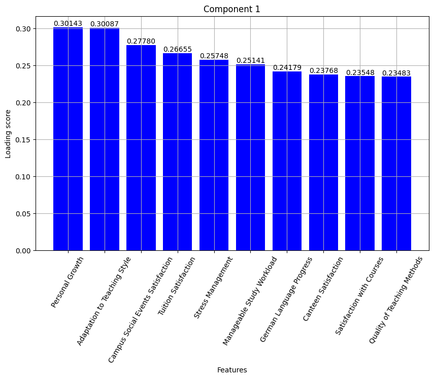

# Project: Principle Component Analysis in finding key factors of VGU Students' Happiness

This study aims to explore the factors that contribute to the happiness of students at Vietnamese-German University (VGU) by applying Principle Component Analysis to the collected survey dataset. The survey contains multiple student life aspects, including study workload, campus facilities, social life, and mental health. We first standardized the data and then performed PCA to reduce its dimensionality while retaining the maximum variance. The results indicated that several principal components that is a main contributions to student satisfaction, such as study workload, social life, and campuas facilities. Notably, components related to personal growth, teaching quality, social events and scholarship were found to have the highest impact on student well-being. This analysis helps to gain valuable insights for university administrators to improve the student services.

